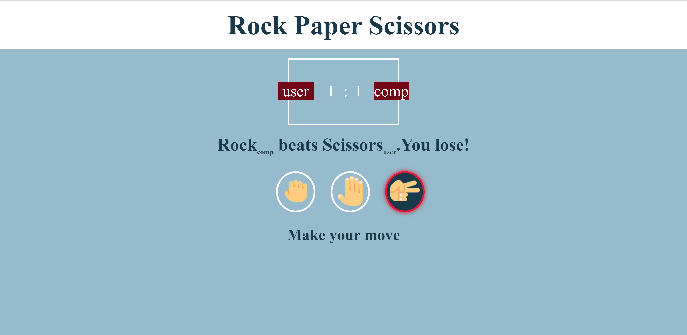

# Rock Paper Scissors
## This is a visual JavaScript rock paper scissors game played against the computer.

This is the image of the basic layout of the game 

When the mouse hovers on top of the choice its background color changes. 

This is a draw between computer and user and is indicated with a grey border and glow around user choice. No change in scoreboard seen. 

The user wins.This is indicated by green border and glow around user choice. Scoreboard updates accordingly. 

The user loses.This is indicated by red border and glow around user choice. Scoreboard updates accordingly. 
